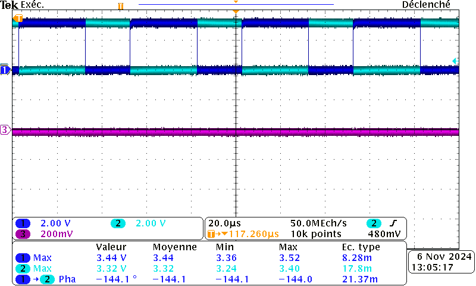
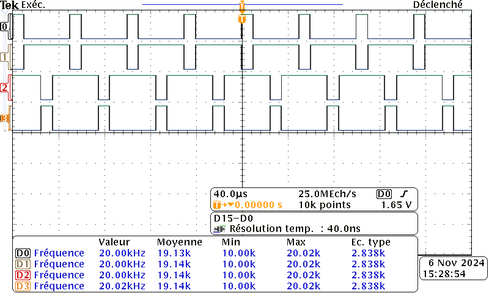
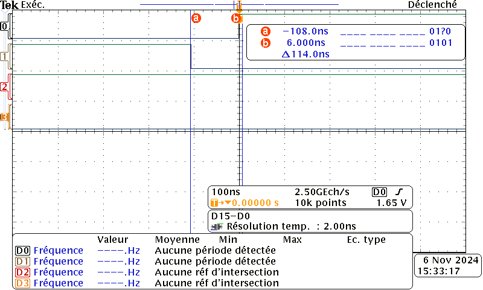

# 2324_ESE3745_GUIFFAULT_JACQUOT


## 6.1. Génération de 4 PWM

Générer quatre PWM sur les bras de pont U et V pour controler le hacheur à partir du timer déjà attribué sur ces pins.

<ins> **Cahier des charges :** </ins>

- [x] Fréquence de la PWM : 20kHz

La frequence de base  de la clock est 170MHz

Pour cela on utilise le timer 1 et on regle ARR=8499 PRSC=0


- [x] Mettre en place un Temps mort

Temps mort minimum d'apres la datasheet:

turn off delay time 39ns

fall time 35ns

> [!CAUTION]
>On va donc prendre un temps mort de 100ns pour avoir une bonne marge de securité.
> 
>Le dead Time est une **nécessité** pour éviter de detruire les transistors durant la commutation 

- [x] Résolution minimum : 10bits.

Pour les tests, fixer le rapport cyclique à 60%.
alpha =0.6
Une fois les PWM générées, les afficher sur un oscilloscope et les faire vérifier par votre professeur.
> [!IMPORTANT]
> 
>!!!Activer le PWM et le PWMN!!! :
> 
>```C
>HAL_TIM_PWM_Start(&htim1,TIM_CHANNEL_1);
>HAL_TIMEx_PWMN_Start(&htim1, TIM_CHANNEL_1); la complementaire
>```


##  Code shell.c : 

 ```C
 /* shell.c*/

#include "usart.h"
#include "mylibs/shell.h"
#include <stdio.h>
#include <stdlib.h>
#include <string.h>

#define MAX_PERCENTAGE 100
#define PWM_MAX_DUTY_CYCLE 8499

 ```
 ```C
void Shell_Init(void){
	memset(argv, 0, MAX_ARGS*sizeof(char*));
	memset(cmdBuffer, 0, CMD_BUFFER_SIZE*sizeof(char));
	memset(uartRxBuffer, 0, UART_RX_BUFFER_SIZE*sizeof(char));
	memset(uartTxBuffer, 0, UART_TX_BUFFER_SIZE*sizeof(char));

	HAL_UART_Receive_IT(&huart2, uartRxBuffer, UART_RX_BUFFER_SIZE);
	HAL_UART_Transmit(&huart2, started, strlen((char *)started), HAL_MAX_DELAY);
	HAL_UART_Transmit(&huart2, prompt, strlen((char *)prompt), HAL_MAX_DELAY);
}

void Shell_Loop(void){
	if(uartRxReceived){
		switch(uartRxBuffer[0]){
		case ASCII_CR: // Nouvelle ligne, instruction à traiter
			HAL_UART_Transmit(&huart2, newline, sizeof(newline), HAL_MAX_DELAY);
			cmdBuffer[idx_cmd] = '\0';
			argc = 0;
			token = strtok(cmdBuffer, " ");
			while(token!=NULL){
				argv[argc++] = token;
				token = strtok(NULL, " ");
			}
			idx_cmd = 0;
			newCmdReady = 1;
			break;
		case ASCII_BACK: // Suppression du dernier caractère
			cmdBuffer[idx_cmd--] = '\0';
			HAL_UART_Transmit(&huart2, backspace, sizeof(backspace), HAL_MAX_DELAY);
			break;

		default: // Nouveau caractère
			cmdBuffer[idx_cmd++] = uartRxBuffer[0];
			HAL_UART_Transmit(&huart2, uartRxBuffer, UART_RX_BUFFER_SIZE, HAL_MAX_DELAY);
		}
		uartRxReceived = 0;
	}
```
### Commandes du shell
```C
	if(newCmdReady){
		if(strcmp(argv[0],"WhereisBrian?")==0){
			HAL_UART_Transmit(&huart2, brian, sizeof(brian), HAL_MAX_DELAY);
		}
		else if(strcmp(argv[0],"help")==0){
			int uartTxStringLength = snprintf((char *)uartTxBuffer, UART_TX_BUFFER_SIZE, "Print all available functions here\r\n");
			HAL_UART_Transmit(&huart2, uartTxBuffer, uartTxStringLength, HAL_MAX_DELAY);
		}
		else if(argc == 2 && strcmp(argv[0], "speed") == 0) {
	        int percentage = atoi(argv[1]);  // Convertit l'argument en pourcentage
	        setPWM(percentage);
		}
		else{
			HAL_UART_Transmit(&huart2, cmdNotFound, sizeof(cmdNotFound), HAL_MAX_DELAY);
		}
		HAL_UART_Transmit(&huart2, prompt, sizeof(prompt), HAL_MAX_DELAY);
		newCmdReady = 0;
	}
}
```

C'est dans cette partie du code que l'on rajoute de nouvelles commandes avec la suite de else If.

    
> [!TIP]
> Pour faire des commandes en deux mots comme speed xxx on compare simultanément la commande en terme de nombre de mots de commande (ici 2)
>et on compare le premier terme avec argv[0] 

```c
void HAL_UART_RxCpltCallback(UART_HandleTypeDef *huart) {
    if (huart->Instance == USART2) {
        uartRxReceived = 1;
        HAL_UART_Receive_IT(&huart2, uartRxBuffer, UART_RX_BUFFER_SIZE);
    }
}
```
<p align="left">  </p>
Image d'un PWM avec son complémentaire avec alpha = 60%, F=20kHz et DT = 0( uniquement quand pas de puissance )


<p align="left">  </p>

Image de la Commande complémentaire décalée avec alpha = 30%, F=20kHz et DT = 100ns

<p align="left">  </p>
Visualisation du dead time


> [!TIP]
>
>
>
> parametrage de TIM1 pour une commande complémentaire décalée a 20kHz


# 7. TP n°2 - Commande en boucle ouverte, mesure de Vitesse et de courant

```C

"if(newCmdReady){
		if(strcmp(argv[0],"WhereisBrian?")==0){
			HAL_UART_Transmit(&huart2, brian, sizeof(brian), HAL_MAX_DELAY);
		}
```
Voici le code du start dans le shell avec un message pour signaler l'execution.
> [!TIP]
Pour le code de la commande start ne pas oublier de définir htim1 avec:
> ```C
> extern TIM_HandleTypeDef htim1;
> ```

```C
		else if (strcmp(argv[0], "start") == 0) {
		     TIM1->CCR1 = PWM_MAX_DUTY_CYCLE / 2;
		     TIM1->CCR2 = PWM_MAX_DUTY_CYCLE / 2;

		     HAL_TIM_PWM_Start(&htim1, TIM_CHANNEL_1);
		     HAL_TIMEx_PWMN_Start(&htim1, TIM_CHANNEL_1);
		     HAL_TIM_PWM_Start(&htim1, TIM_CHANNEL_2);
		     HAL_TIMEx_PWMN_Start(&htim1, TIM_CHANNEL_2);

		     int uartTxStringLength = snprintf((char *)uartTxBuffer, UART_TX_BUFFER_SIZE,
		                                              "PWM started at 50%% duty cycle\r\n");
		     HAL_UART_Transmit(&huart2, uartTxBuffer, uartTxStringLength, HAL_MAX_DELAY);
		}
```
Voici le code du stop dans le shell avec un message pour signaler l'execution.
```C
		else if (strcmp(argv[0], "stop") == 0) {
		                 // Stoppe le PWM sur tous les canaux
		      HAL_TIM_PWM_Stop(&htim1, TIM_CHANNEL_1);
		      HAL_TIMEx_PWMN_Stop(&htim1, TIM_CHANNEL_1);
		      HAL_TIM_PWM_Stop(&htim1, TIM_CHANNEL_2);
		      HAL_TIMEx_PWMN_Stop(&htim1, TIM_CHANNEL_2);

		      int uartTxStringLength = snprintf((char *)uartTxBuffer, UART_TX_BUFFER_SIZE,
		                                                   "PWM stopped\r\n");
		      HAL_UART_Transmit(&huart2, uartTxBuffer, uartTxStringLength, HAL_MAX_DELAY);
		}
```
Code commande "speed" avec un changement progressif de la PWM
```C
		else if (strcmp(argv[0], "help") == 0) {
		            int uartTxStringLength = snprintf((char *)uartTxBuffer, UART_TX_BUFFER_SIZE,
		                                              "Available commands:\r\n"
		                                              " - start: Start PWM at 50%% duty cycle\r\n"
		                                              " - stop: Stop PWM generation\r\n"
		                                              " - speed <percentage>: Set motor speed as a percentage (0-100%)\r\n"
		                                              " - WhereisBrian?: Where is Brian ?\r\n");
		            HAL_UART_Transmit(&huart2, uartTxBuffer, uartTxStringLength, HAL_MAX_DELAY);
		}
		else if (argc == 2 && strcmp(argv[0], "speed") == 0) {
		    int percentage = atoi(argv[1]);  // Convertit l'argument en pourcentage
		    if (percentage >= 0 && percentage <= 100) {
		        static int i_old = 50;
		        int i;

		        for (i = i_old; i != percentage;) {
		            if (i > percentage) {
		                setPWM(i);
		                i--;
		                HAL_Delay(100);
		            } else if (i < percentage) {
		                setPWM(i);
		                i++;
		                HAL_Delay(100);
		            }
		        }

		        i_old = percentage;
		    } else {
		        int uartTxStringLength = snprintf((char *)uartTxBuffer, UART_TX_BUFFER_SIZE,
		                                          "Error: Percentage must be between 0 and 100\r\n");
		        HAL_UART_Transmit(&huart2, uartTxBuffer, uartTxStringLength, HAL_MAX_DELAY);
		    }"
```
> [!Warning]
> Il est fortement conseillé de rajouter le traitement des commandes absurdes (<0 et >100)
> pour eviter de cramer les composant sur une faute de frappe. Ne pas oublier le HAL_Delay
## 7.2. Mesure du courant
